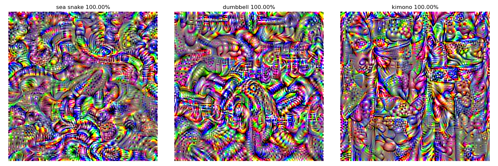

# eXplainable AI

## ActMax

ActMax - Activation Maximization

## AdvImg

AdvImg - Adversarial Images

## DeepDream

DeepDream - Deep Dream Nightmare

## SaliencyMap

SaliencyMap - Saliency Map

### Vanilla Gradients

### Integrated Gradients

### Occlusion

### Deconvolution

### Guided Backpropagation

### Class Activation Map

### Grad-CAM

